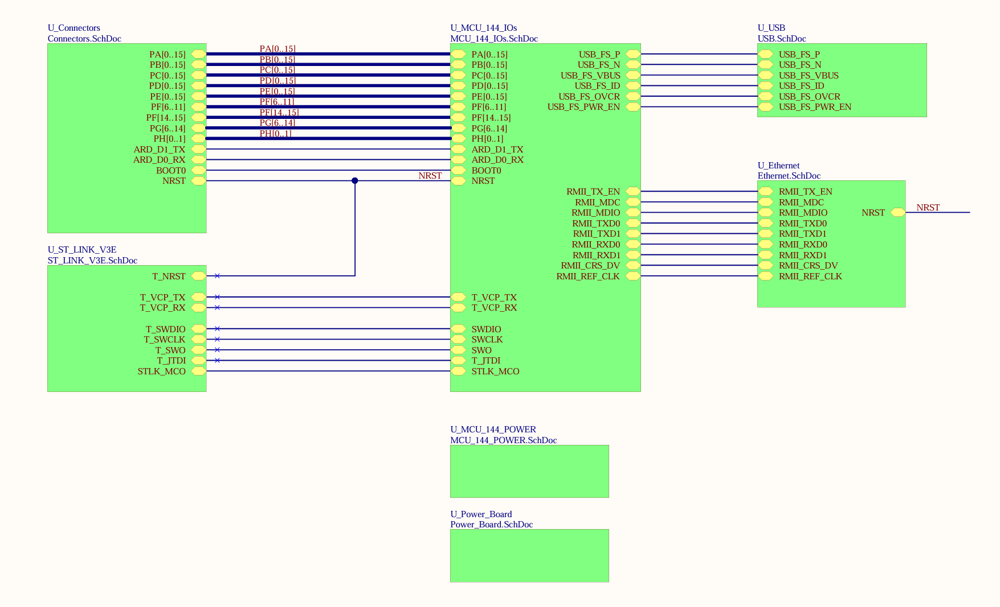

# NUCLEO_H755ZI-Q
NUCLEO_H755ZI-Q testing
---

## 📑 Table of Contents

- [🔗 Links](#-links)
- [📌 Pinout](#-pinout)
- [📜 Examples](#-examples)
    - [EXTI](#exti)
---

## 🔗 Links

[STM32H755ZI](https://www.st.com/en/microcontrollers-microprocessors/stm32h755zi.html)

[NUCLEO-H755ZI-Q](https://www.st.com/en/evaluation-tools/nucleo-h755zi-q.html)

---

## 📌 Pinout

---

## 📜 Examples
### EXTI

In this example, one EXTI line (EXTI15_10) is configured to generate
an interrupt on each rising edge for both Cores : CPU1 (Cortex-M7) and CPU2 (Cortex-M4)
In the EXTI interrupt routine of each CPU a led connected to a specific GPIO pin is toggled.

CPU1 (Cortex-M7) and CPU2 (Cortex-M4) are booting at once (with respect to configured boot Flash options)
System Init, System clock, voltage scaling and L1-Cache configuration are done by CPU1 (Cortex-M7).
In the meantime Domain D2 is put in STOP mode (CPU2: Cortex-M4 in deep sleep mode) to save power consumption.
When system initialization is finished, CPU1 (Cortex-M7) will release CPU2 (Cortex-M4) when needed
by means of HSEM notification but release could be also ensured by any Domain D2 wakeup source (SEV,EXTI..).

The above will guarantee that CPU2 (Cortex-M4) code execution starts after system initialization :
(system clock config, external memory configuration..)

After Domain D2 wakeup, if  CPU1 attempts to use any resource from such a domain, 
the access will not be safe until “clock ready flag” of such a domain is set (by hardware). 
The check could be done using this macro : __HAL_RCC_GET_FLAG(RCC_FLAG_D2CKRDY).